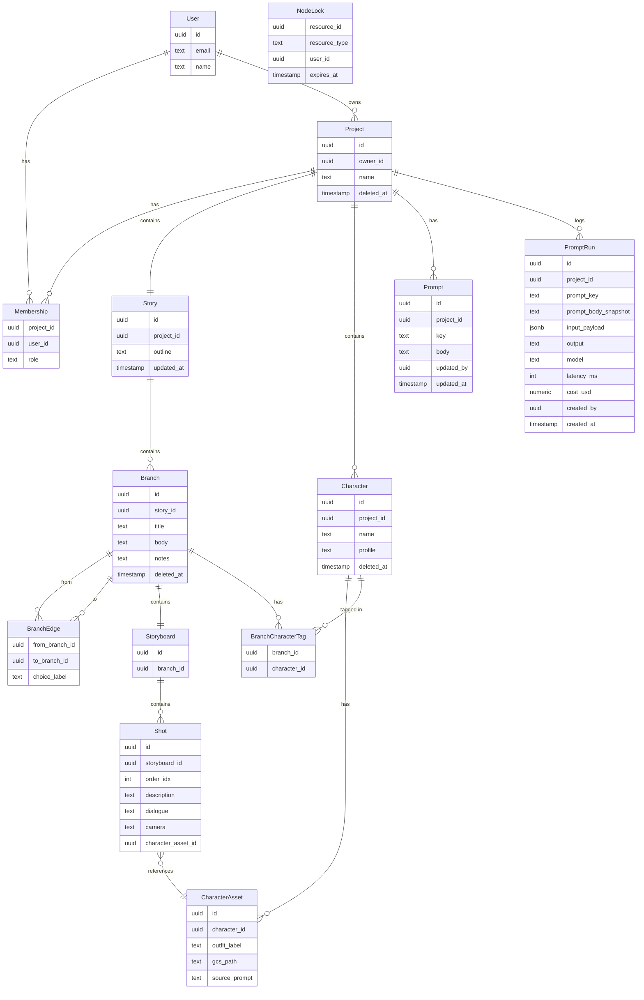
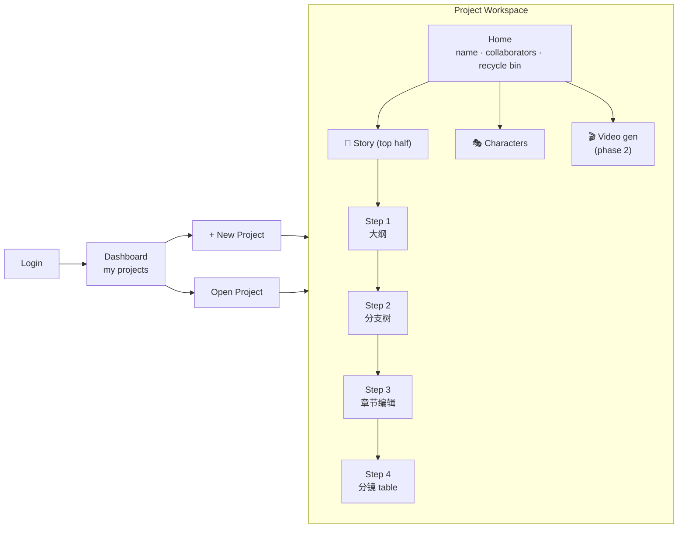

# VN Authoring Platform - PRD

**Status:** v3 — final (locked 2026-05-04)
**Date:** 2026-05-01 (created), updated 2026-05-04
**Author:** chiauhung
**Related:** vn-poc (sibling repo at `../vn-poc/`) · [Stack reference](./stack-reference.md)

---

## 1. Vision

A web platform for **collaborative authoring of branching interactive video stories**. Author 写大纲 → 拉分支 → 写章节 → 出分镜; 系统 AI-assist 生草稿, user 控制 edit. 角色是 first-class object, 用 Nano Banana 生图 (含不同 outfit). 输出最后喂给 video pipeline (phase 2) — 终点是出 Steam game.

**Why this exists (3 layers):**
- vn-poc 验证了 format. 手编 `story.json` 不 scale. 这平台替掉那个痛点.
- User 学 fullstack TS stack 的载体 (slot-filling exercise).
- **User 转 FDE (Forward Deployed Engineer) 的训练场** — 强制走 Level B 自托管 K8s, 触摸 Postgres ops / Redis / k8s networking / TLS / auth / logs 这些 managed service 平时藏起来的层.

---

## 2. Users & Roles

| Role | Permissions |
|------|-------------|
| **Owner** | 创建 project. Full access. 加/移 collaborator. 删 project. |
| **Editor** | 读+写所有 features. 不能管 collaborator. |
| (Phase 2) Viewer | Read-only |

**MVP:** 只有 Owner + Editor. Flat collaborator model — 加进来的人都能编一切.

---

## 3. Core Entities (ERD)



**Key schema choices:**

- **Branch graph = DAG** via `BranchEdge` (M2M self-relation). 允许 convergent paths (多选汇到同一节点).
- **Soft delete via `deleted_at`** on `Project` / `Branch` / `Character`. Recycle bin = `WHERE deleted_at > now() - 30 days`. Cron 定期 hard-delete 超过 30 天的.
- **State / unlock conditions deferred** — 不放 `state_effects` / `unlock_condition` 字段. Phase 2 再 layer 上去 (per Q2).
- **`CharacterAsset.gcs_path`** = pointer 进 GCS bucket (unstructured store).
- **`NodeLock`** = soft-lock heartbeat 表, 60s TTL. Advisory only, 不阻止 LWW.
- **`Prompt`** = 当前 prompt 文本 (per-project, 固定几个 key: `chapter_gen`, `storyboard_gen`, `character_image_prompt`). 项目 create 时从 system default copy 进来.
- **`PromptRun`** = 每次 LLM 调用的 log 行. **`prompt_body_snapshot` 把当时 prompt 全文存下来** — user 改 prompt 不破坏历史 traceability. 不做单独的 prompt version 表, 简化.

---

## 4. User Flow



**Project workspace layout — 2-column guided flow:**

```
┌─────────────────────────────────────────────────────────────┐
│ Project: My VN          [collaborators]  [🗑 recycle bin]    │
├─────────────────────────────────────────────────────────────┤
│ 📖 Top half — Story                                         │
│ Steps:  [1 大纲] → [2 分支树] → [3 章节] → [4 分镜]            │
│ ┌─────────────────────────────────────────────────────────┐ │
│ │ (current step's editor)                                 │ │
│ └─────────────────────────────────────────────────────────┘ │
├─────────────────────────────────────────────────────────────┤
│ 🎬 Bottom half — Video (phase 2)                            │
│ ┌─────────────────────────────────────────────────────────┐ │
│ │ TBD                                                      │ │
│ └─────────────────────────────────────────────────────────┘ │
│                                                             │
│ Side panel (always visible): Characters list                │
└─────────────────────────────────────────────────────────────┘
```

---

## 5. Feature Spec

### 5.1 Project & Collaboration

- **Create project** — name only, create.
- **Add collaborator by email** — invite (or instant if already has account, MVP).
- **Recycle bin** — view soft-deleted branches/characters/projects within 30 天; restore or hard-delete now.
- **Presence indicator** — 当其他 collaborator 正在编同一 chapter/branch, 显示 "Alice is editing this" badge.
  - Implementation: client 打开 editor → tRPC mutation 写 `NodeLock(resource_id, user_id, expires_at=now+60s)`. 每 30s heartbeat 续命.
  - 其他 client poll 这个表 (e.g. 每 10s), see lock → render badge.
  - Pure advisory — last-write-wins 还是 winner.
- **Conflict policy** — last-write-wins. Soft-lock 不阻止编辑.

### 5.2 Story Authoring

#### 5.2.1 Step 1 — 大纲
- 单一 rich-text editor. Project-level, 一个 story 一份.
- Free-form. 后续 AI 生章节时读这个.

#### 5.2.2 Step 2 — 分支树 (DAG with spine layout)
- xyflow 渲染 + dagre auto-layout — 视觉上像 spine 主线 + 旁支汇回.
- Add node, delete node (→ recycle bin), connect with edge.
- Edge 有 optional `choice_label` (e.g. "选择 A: 救她").
- DAG: 节点可有多个 incoming edges (convergent paths).
- **Cycles forbidden** — UI prevents on edge create.
- 点 node → enters Step 3 for that branch.

#### 5.2.3 Step 3 — 章节编辑器
- Per-branch text editor (chapter body).
- **AI-assist:** "Generate chapter from outline + parents" → LLM 读 (story.outline + ancestor branches' bodies) → drafts text. User edits.
- **Notes field** — author scratchpad. Phase 2 这里挂 conditions / state effects.
- **Character tag panel** — multi-select project's characters appearing in this chapter.

#### 5.2.4 Step 4 — 分镜 Table
- Per-branch shot table. 一行一个 shot.
- **Fixed columns (MVP):** `#`, `description`, `dialogue`, `camera`, `character + outfit`.
- **AI-assist:** "Generate storyboard from chapter text" → fills rows. User edits.
- "Character + outfit" cell: dropdown — 选 Character → 选 outfit (CharacterAsset). 缩略图预览.
- Save row-by-row 或 whole table.

### 5.3 Character Feature

- **Character list** — all characters in project. Add / edit / soft-delete.
- **Character profile** — name + description (用作 image gen prompt context).
- **Asset generation (Nano Banana / Gemini Flash Image):**
  - Input: outfit/scene description (+ character profile auto-prepended)
  - Output: image → 存 GCS, 记一行 `CharacterAsset(outfit_label, gcs_path, source_prompt)`
  - 每个 character 多个 variants (Casual / 校服 / Date / ...)
- **Asset gallery** — 看一个 character 的全部 variants; star 一个 default.
- 这些 assets 是 Step 4 storyboard 的下拉来源.

### 5.4 Prompt Management

**Goal:** Author 可以改驱动 AI 的 prompts, 但所有调用都被 log 起来 (含当时 prompt 全文), 方便 debug 跟比较输出质量.

**Scope (MVP):**
- 3 个固定 prompt keys per project:
  - `chapter_gen` — 输入 (outline + ancestor branch bodies) → 输出章节草稿
  - `storyboard_gen` — 输入 (chapter body + tagged characters) → 输出 shot rows
  - `character_image_prompt` — 输入 (character profile + outfit description) → 输出 image gen prompt
- Project 创建时, 这 3 个 prompt 从 system default copy 一份进 `Prompt` 表
- Project settings → "Prompts" tab:
  - 列 3 个 prompt + body 文本框 + Save
  - 点一个 prompt → 看历史 `PromptRun` (input / output / model / latency / cost)
- **不做 (defer to phase 2):**
  - Prompt 版本表 (current MVP: 改了就改了, snapshot 进 PromptRun 保证 traceability)
  - A/B test 同一 key 不同 prompt
  - Eval / scoring / dataset (Langfuse 那一套)
- **Phase 2 escape hatch:** 真要深度观测可以把 PromptRun 双写 Langfuse SDK, 不需重写

**为什么不直接用 Langfuse:**
- Prompt 编辑是 platform UX 的一部分, user 在 app 内改, 不该跳走第三方 console
- MVP 只要 traceability + editable, 不要 dataset/eval/scoring 这些 — 自建轻得多 (2 张表)

### 5.5 Video Generation (Phase 2 placeholder)
TBD — bottom half of project workspace. 详细 spec MVP 出了再讨论.

---

## 6. Tech Stack (locked)

Based on [stack reference](./stack-reference.md) + 这次 6 个 driver 问题:

| Slot | Pick | Why |
|------|------|-----|
| HTTP server | **Next.js 15 App Router** | Cloud Run + Vercel 都能跑; RSC 对 editor 页有用 |
| API layer | **tRPC v11** | Shared spine; 类型 end-to-end |
| Validation | **Zod** | 不商量 |
| Database | **Postgres** | DAG 关系查询、soft-delete TTL、collab join — relational 赢 |
| ORM | **Drizzle** | 贴近 SQL; migrations 干净 |
| Auth | **BetterAuth** (Next.js in-app library) | Level B self-host. 跑在 app 进程内, session/邀请 email 都自己管. 不用 Clerk (vendor). |
| Object storage | **MinIO** (S3-compatible, self-host) | Level B. App 用 `@aws-sdk/client-s3` 连, endpoint 换 GCS/S3 不动代码 |
| Server state | **TanStack Query** | Mutation UX 比 SWR 好 (editor 重 mutation) |
| Client state | **Zustand + Immer** | Editor draft state |
| URL state | **nuqs** | "现在打开哪个 branch" 放 URL → shareable |
| Forms | **react-hook-form + Zod** | Storyboard table、character editor |
| UI | **Radix + shadcn + Tailwind v4** | |
| Branch viz | **xyflow (React Flow)** + dagre layout | DAG 渲染 + auto spine |
| Rich text | **Tiptap** or **Plate** — *defer* | 章节 body editor — 选哪个等 5.2.3 实施再决 |
| AI SDK | **Vercel AI SDK** | 文本 streaming gen (chapter / storyboard) |
| AI provider | **OpenRouter** | 一个 API 接所有 model. Phase 2 想换 model / A/B test 不用动代码 |
| Image gen | **Gemini Flash Image (Nano Banana)** | per spec — 经 queue, 异步 |
| Job queue | **BullMQ + Redis** (self-host in cluster) | Image gen 异步; Redis 也 cluster 内 |
| Database hosting | **CloudNativePG operator** (Postgres in cluster) | Level B self-host; learn Postgres ops |
| Hosting | **Kubernetes + Helm chart** — **Level B (strict self-host)** | 不用 cloud managed services. GKE 当 k8s control plane 是可以 (k8s 还是 portable layer), 但 Postgres/Redis/Storage/Auth 全在 cluster |
| Ingress / TLS | **Nginx Ingress + cert-manager + Let's Encrypt** | 标准 self-host TLS |
| Secrets | **Plain k8s secrets** (MVP); Vault / sealed-secrets defer | 起步阶段最小复杂度 |
| Skipped (MVP) | i18n, Sentry, Pino, feature flags, GitOps (Argo CD), Prometheus/Grafana, network policies, HA replicas | 没痛点不加; 学习路径上后面再补 |

**Rationale for skipped slots:**
- **i18n**: 中英 mix 暂时只服务自己, MVP 不做 multi-language
- **Sentry**: 没真用户, dev 阶段 console + Cloud Logging 够
- **Pino**: 同上
- **Feature flags**: 没需要 gradual rollout

**Streaming vs Queue 分工:**
- **文本 gen (chapter, storyboard)** → **streaming** via Vercel AI SDK + OpenRouter. 每个 HTTP connection 独立, 不会因为多人 click 互相 block. User 看见字一个字出来.
- **图像 gen (Nano Banana)** → **queue** via BullMQ. Response 是 binary, 不能 stream; API 慢 (10-30s) + rate-limited. User click "generate" → 即时返回 job_id → poll 或 SSE 看进度 → done 显示.

---

## 7. MVP / Phase 2 / Later 三档

### MVP (ship first)
- ✅ Auth, Project CRUD + collab invite
- ✅ Recycle bin (30-day soft delete)
- ✅ Story authoring: 大纲 + 分支树 + 章节 + 分镜 table
- ✅ Character: create + Nano Banana asset gen (queued) + outfit gallery
- ✅ Soft-lock presence indicator
- ✅ AI assist: chapter gen + storyboard gen (streaming via OpenRouter)
- ✅ Prompt management (3 fixed keys, editable per project, run log)

### Phase 2
- Video generation (bottom half) — 详细 spec 待定
- State / 数值 / unlock conditions layered on top of stable DAG
- Path simulator — walk DAG 看哪个 ending 解锁哪些 affinity scenes
- 把 vn-poc engine 端进来当 player runtime preview

### Later (想想就好)
- Realtime collab (Yjs / Liveblocks)
- Viewer role + public read-only share links
- Proper version snapshots (v1 / v2 / v3 history)
- i18n
- Export to Steam package (Tauri / Electron)

---

## 8. Open Questions

| # | Question | Decide when |
|---|----------|-------------|
| 1 | Rich text editor — Tiptap vs Plate? | At 5.2.3 implementation |
| ~~2~~ | ~~AI text provider~~ | ✅ **OpenRouter** (closed) |
| ~~3~~ | ~~K8s portability level~~ | ✅ **Level B strict self-host** (closed) |
| 4 | K8s cluster — 本地 kind 起步 + 后期 GKE 部署? 还是直接 GKE? | Scaffold 第 0 步 |
| ~~5~~ | ~~Auth library~~ | ✅ **BetterAuth** (closed) |
| 6 | Nano Banana per-image cost & quota | 在做 5.3 之前估 |
| 7 | Soft-lock TTL — 60s? 120s? 5min? | 先 60s, 用了再 tune |
| 8 | Storyboard "shot" 描述长度 — 自由文本 vs 限长? | 先自由文本, 看 AI 质量 |
| 9 | OpenRouter default model 选哪个 per-prompt? | Scaffold 阶段, 可 per-prompt 配 |
| 10 | Domain name (for ingress + TLS)? | Milestone 7 (GKE 部署) 之前 |

---

## 9. Process & Learning Plan

### Process so far
1. ✅ Discuss requirements (Q1-Q5 — 2026-05-01)
2. ✅ PRD v1 → v2 (queue + OpenRouter + Prompt schema added — 2026-05-01)
3. ✅ Hosting locked → Level B strict self-host (2026-05-04)
4. ⏳ **Quiz format sign-off** (current step)
5. PRD v3 final lock
6. Scaffold (Milestone 1)

### Milestones (7 total)

| # | Milestone | What "done" looks like |
|---|-----------|------------------------|
| 1 | Local k8s baseline | kind cluster up; Postgres (CNPG) + Redis + MinIO running; can `kubectl exec` into each |
| 2 | Helm chart skeleton | `helm install vn-platform ./chart` deploys app shell + BetterAuth login page works |
| 3 | Project + collab + recycle bin | Create project, invite teammate, soft-delete, restore from bin |
| 4 | Story tree + chapter editor + soft-lock | DAG visible in xyflow; edit chapter text; "X is editing" badge appears |
| 5 | Storyboard + character + Nano Banana queue | Generate character image, see job in BullMQ, image lands in MinIO, displays in storyboard cell |
| 6 | Prompt mgmt + OpenRouter streaming | Edit `chapter_gen` prompt; click generate; tokens stream into editor; PromptRun row logged |
| 7 | GKE 部署 + ingress + TLS | Helm install on real GKE cluster; cert-manager issues Let's Encrypt cert; public URL works |

### Learning loop — quiz after each milestone

每个 milestone 收尾后, 我出 4 题 4 levels (FDE 真遇到的题型), 你试答, 我点评. 不会答的部分 = 那块回去 build 再巩固.

**Levels:**
- **L1 基础** — 立即排查路径 (e.g. "Pod CrashLoopBackOff, 前 3 步看什么?")
- **L2 中阶** — Isolation 思路 (e.g. "Postgres slow query, 怎么 isolate index 还是 query plan?")
- **L3 进阶** — 修复操作 (e.g. "Helm upgrade 失败 release state 不干净, 怎么手动 surgery?")
- **L4 War story** — 模糊问题 hypothesis 生成 (e.g. "用户说 AI 生章节有时 hang, logs 看不出, 5 分钟内 hypothesis list?")

**总量:** 7 milestones × 4 题 = ~28 题. 这 28 题答得下来 → FDE 基础肌肉成形.

### Done criteria for "FDE-ready" on this project
- 任意一个组件 (Postgres, Redis, MinIO, app, worker, ingress) 挂掉, 你能在 15 分钟内 isolate 是哪层
- Helm chart 改了 values 你能预测 manifest 怎么变 (不靠 dry-run)
- TLS cert 没续上你知道去 cert-manager 哪个 CRD 看
- Auth session 不刷新你知道是 cookie / db / lib 哪一层
