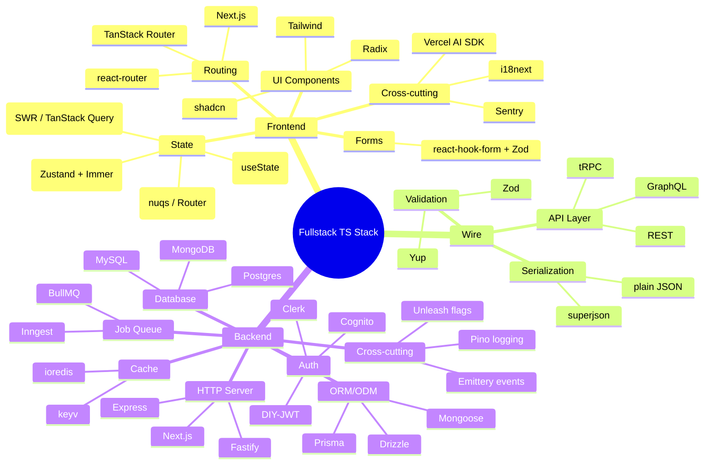
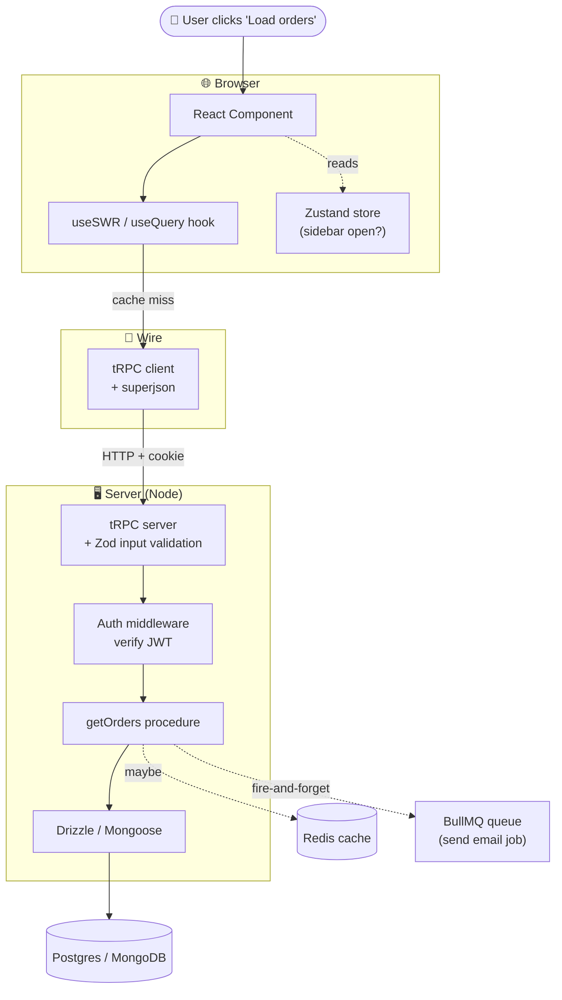

# Modern Fullstack TS Stack - Slots and Choices

**Date:** 2026-04-28
**Source:** Discussion + decoding two colleagues' repos
**Context:** I'm a data engineer learning fullstack piece by piece. My company is rewriting from scratch and two colleagues already proposed different stacks. Decoding both clarified that "stack choice" is just slot-filling, not magic.

---

## The big idea

> **A fullstack app has ~20 "slots". Each slot has 2-5 popular library picks. No team fills all slots — they pick the subset that matches their problems. Reading any stack list = identifying which slots they filled with what.**
>
> **看到 slots, 就不会被各种 library names 吓到了.**

This is the same trick as understanding storage engines: once you see the trade-offs (read/write/space), every engine becomes a variant of the same template.

---

## The architecture — mind map view

---

## How a request actually flows

**The clean separation of jobs:**
- **Hook** = "do I need to fetch? do I have a cached value?"
- **tRPC client** = "serialize this typed call, send it over HTTP"
- **tRPC server** = "match the procedure, validate the input, run it"
- **Auth middleware** = "is this user allowed?"
- **ORM** = "translate this code into SQL/Mongo query"
- **Cache** = "have we computed this recently?"
- **Queue** = "this is slow, do it in the background"

---

## Q: Why so many slots?

Each slot exists because someone got burned **not having that slot**.

| Slot | Pain it solves |
|------|---------------|
| **Validation (Zod)** | TypeScript types disappear at runtime → API accepts garbage. Zod gives runtime + compile-time validation from one schema. |
| **Server state cache (SWR/Query)** | Reinventing loading/error/refetch/cache logic per endpoint = death by a thousand cuts. |
| **Client state (Zustand)** | Prop drilling 5 levels to share a `user` object becomes spaghetti. |
| **URL state (nuqs)** | "Current tab" stored in Zustand → can't share, can't bookmark, refresh loses it. |
| **Forms (react-hook-form)** | Form state has 10 hidden complexities (touched, dirty, submitting, async validation). DIY = waste. |
| **Job queue (BullMQ)** | Sending an email synchronously inside a request = slow + brittle. Push to queue → respond immediately. |
| **Feature flags (Unleash)** | Coupling deploys to feature releases means you can't roll out gradually or kill a bad feature without redeploy. |
| **Error tracking (Sentry)** | "It works on my machine" but explodes for users — you'd never know without prod error capture. |
| **i18n (i18next)** | Hardcoded English strings = no path to multi-language without rewriting every component. |
| **Logger (Pino)** | `console.log` is unstructured noise; structured JSON logs are queryable in cloud logging. |

**You skip slots if you don't have the pain yet.** That's why the two colleagues' stacks differ.

---

## Two real stacks side-by-side

| Slot | Colleague 1 (talent-platform-vibe) | Colleague 2 |
|------|-----------------------------------|-------------|
| **HTTP server** | Next.js (route handlers) | Fastify |
| **API layer** | tRPC v11 ✓ | tRPC v11 ✓ |
| **Auth** | AWS Cognito + Amplify | Fastify-JWT + cookies (DIY) |
| **Database** | Postgres | MongoDB |
| **ORM/ODM** | Drizzle | Mongoose |
| **Cache** | keyv + @keyv/redis | ioredis |
| **Job queue** | — | BullMQ |
| **Validation** | Zod ✓ | Zod ✓ |
| **Serialization** | superjson ✓ | superjson ✓ |
| **Feature flags** | Unleash | — |
| **Logger** | Pino | — |
| **In-process events** | Emittery | — |
| **Routing** | Next.js + react-router (hybrid SPA-in-Next) | TanStack Router |
| **URL state** | nuqs + query-string | (built into TanStack Router) |
| **Server state** | SWR | TanStack Query |
| **Client state** | Zustand v5 + Immer | Zustand + Immer |
| **Forms** | react-hook-form + Zod | — |
| **i18n** | i18next ✓ | i18next ✓ |
| **Error tracking** | Sentry | — |
| **UI components** | Radix + shadcn + Tailwind v4 | — |
| **Specialty UI** | Plate (rich text), xyflow, dnd-kit | — |
| **AI features** | Vercel AI SDK | — |

**Shared spine:** `tRPC + Zustand + Zod + i18next + superjson`. **Everything else is a swap.**

---

## Alternatives per slot — cheat sheet for future repos

| Slot | Popular options (2026) |
|------|------------------------|
| **HTTP server** | Next.js, Fastify, Express, Hono, Elysia |
| **API layer** | tRPC, REST, GraphQL (Apollo / urql) |
| **Auth** | Cognito, Clerk, Auth0, Supabase Auth, NextAuth, DIY-JWT |
| **Database** | Postgres, MySQL, MongoDB, SQLite, Supabase, PlanetScale |
| **ORM/ODM** | Drizzle, Prisma, Mongoose, Kysely, TypeORM |
| **Cache** | ioredis, keyv, Memcached |
| **Job queue** | BullMQ, Inngest, Trigger.dev, AWS SQS |
| **Validation** | Zod, Yup, Valibot, ArkType |
| **Wire serialization** | superjson, plain JSON, msgpack |
| **Feature flags** | Unleash, LaunchDarkly, GrowthBook, PostHog |
| **Logger** | Pino, Winston, Bunyan |
| **Routing (FE)** | Next.js App Router, TanStack Router, react-router |
| **URL state** | nuqs, TanStack Router (built-in) |
| **Server state** | TanStack Query, SWR, Apollo Client (GraphQL) |
| **Client state** | Zustand, Redux Toolkit, Jotai, MobX, Valtio |
| **Forms** | react-hook-form, Formik, TanStack Form |
| **i18n** | i18next, react-intl, lingui |
| **Error tracking** | Sentry, Rollbar, Bugsnag, Datadog RUM |
| **UI components** | Radix + shadcn + Tailwind, MUI, Mantine, Chakra |
| **AI SDK** | Vercel AI SDK, LangChain.js |

---

## DE-to-Frontend translation table

For me, things click when I map them to data engineering concepts I already know.

| Frontend concept | Data engineering analogy |
|-----------------|--------------------------|
| **Drizzle** | SQLAlchemy Core (query builder, stay close to SQL) |
| **Mongoose** | An ODM for documents — like working with a schema'd JSON store |
| **Zod** | pydantic in Python — schema once, get types + validation |
| **Provider (React Context)** | A SQL `WITH` block — scoped value available to everything inside |
| **Server state (SWR/Query)** | A materialized view client — caches a remote source, knows when to refresh |
| **Client state (Zustand)** | A temp table in your notebook session — lives only here, dies on close |
| **URL state (nuqs)** | Query parameters in a dashboard URL — shareable, bookmarkable |
| **BullMQ** | Airflow / Cloud Tasks for short-lived async work |
| **Redis (cache)** | A hot in-memory layer in front of your warehouse, microsecond reads |
| **Pino (logger)** | Writing structured events to BigQuery vs scattering print statements |
| **Sentry** | Datadog APM but specifically for runtime exceptions |
| **Unleash (feature flags)** | A config table you read at runtime to gate features |
| **Emittery (in-process pub/sub)** | A tiny in-memory message queue for decoupling code paths |
| **superjson** | Avro/Parquet preserving types vs CSV losing everything |
| **Vercel AI SDK** | LiteLLM, but on the frontend for streaming LLM responses |

---

## Q: How do I read a new repo's stack now?

**Look at `package.json`.** Group dependencies by slot:

1. **Find the HTTP server** — `next`, `fastify`, `express`, `hono`?
2. **Find the API layer** — `@trpc/*`? Plain REST? GraphQL?
3. **Find the ORM** — `drizzle-orm`, `prisma`, `mongoose`?
4. **Find the auth** — `aws-amplify`, `@clerk/*`, `next-auth`, or hand-rolled?
5. **Find server state** — `swr` or `@tanstack/react-query`?
6. **Find client state** — `zustand`, `redux`, `jotai`?
7. **Find routing** — `next` (App Router), `@tanstack/react-router`, `react-router-dom`?
8. **Find UI** — `@radix-ui/*` + `tailwindcss` is the dominant combo
9. **Find specialty domain libs** — `@platejs/*` = rich text, `@xyflow/react` = flowcharts, etc.

**Once you've slotted everything, you understand the architecture.** No magic.

---

## Things I will never confuse again

1. **Frontend state is at least 4 things, not one:**
   - Local state (`useState`) — one component's scratch paper
   - Client state (Zustand) — UI state shared across components
   - Server state (SWR/Query) — cache of remote data, has loading/error/stale concerns
   - URL state (nuqs/Router) — shareable, bookmarkable, survives refresh
2. **tRPC is a transport, not a cache.** You still need SWR/TanStack Query on top for caching.
3. **Provider (React Context)** = scoped variable injection into a subtree. Like Python's `with` block or SQL's `WITH` CTE.
4. **Next.js is a meta-framework**, not just an HTTP server — it replaces routing + SSR + bundling + API server in one pick.
5. **Don't reinvent forms** — react-hook-form + Zod handles 10 hidden complexities you don't want to touch.
6. **Redis is for latency, not affordability.** RAM is *expensive*; you pay for microsecond access.
7. **Stacks differ because problems differ.** No team fills all 20 slots. Skipping a slot = "we don't have that pain yet".

---

## Mental model to carry forward

> **Frontend = layered slots. Backend = layered slots. Wire = the typed contract between them.**
>
> **每一层都是一个 slot, 每个 slot 有 2-5 个流行的选择. Pick one per slot. Don't pick two.**
>
> When I see a new repo's stack list in 2027 and it has libraries I've never heard of, my move is:
> **"Which slot is this filling? What does it replace?"** That's it.

---

## Links to revisit
- DDIA Ch 3 — storage engines (B-Tree, LSM, in-memory) — **same slot-filling thinking, different layer**
- [[Storage Engine Trade-offs - LSM vs BTree vs Redis]] — sister note
- React docs (Context, hooks)
- tRPC docs — `trpc.io`
- TanStack Query docs — vs SWR mental model
